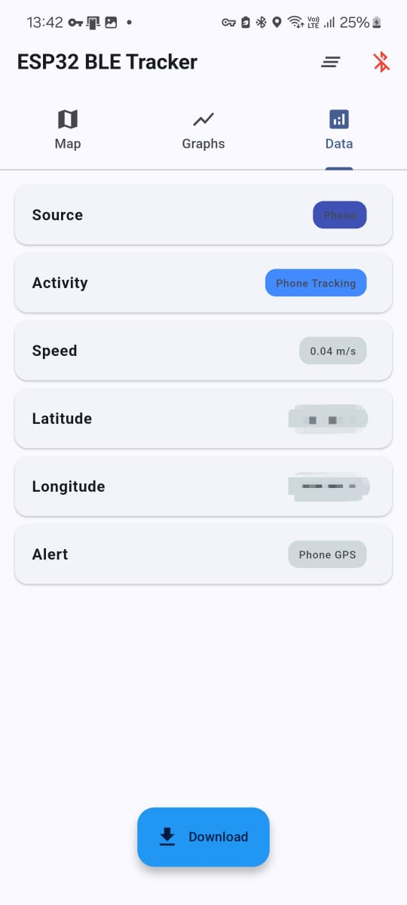
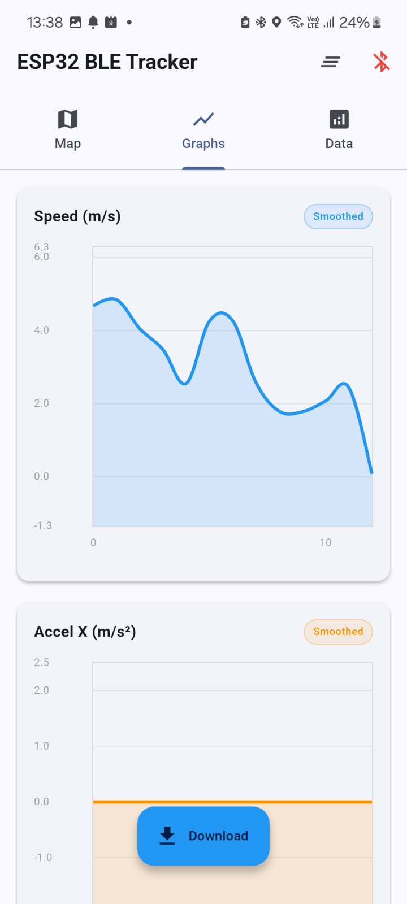
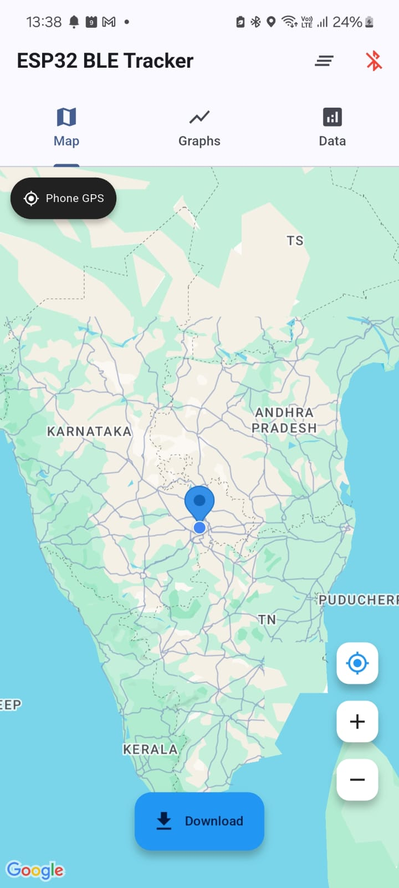
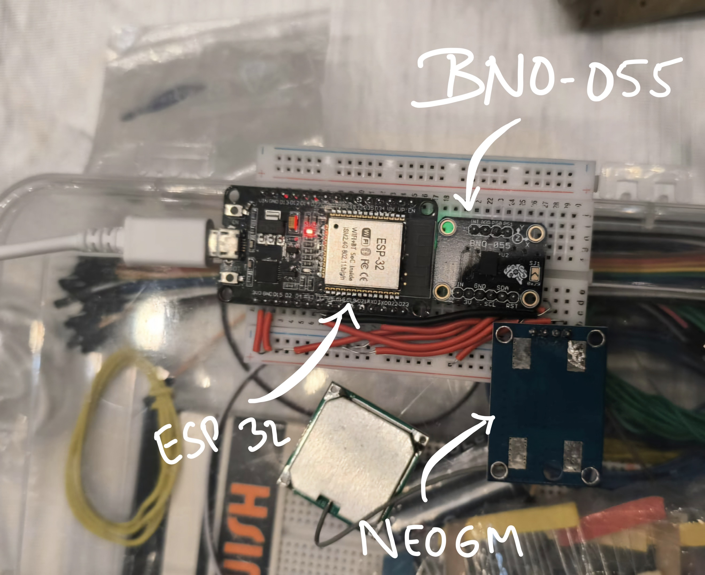
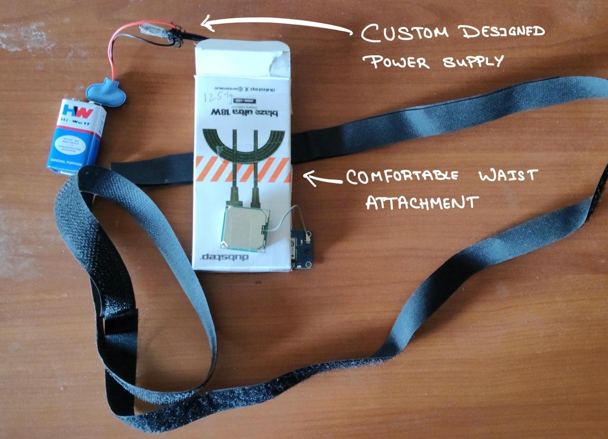

# 🚗 SAFEX – ESP32 BLE GPS Telemetry & Driver Awareness System

> Real-time GPS precision and motion awareness system powered by ESP32 + Android BLE app.

---

## 📸 Project Overview

This project connects an **ESP32** to an **Android app** using **Bluetooth Low Energy (BLE)**.  
The ESP32 continuously sends **JSON-formatted telemetry data** — including GPS coordinates, IMU readings, and motion parameters — to the app.  
The Android app then parses, visualizes, and maps this data live using **Google Maps API**.

Designed to showcase **insane GPS precision** for **fast-moving vehicles** and real-time differentiation between **walking, driving, or idling**.  
This helps maintain driver awareness and ensures better tracking of vehicle dynamics.

---

## 🛰️ Features

- **BLE Connectivity** – Seamless pairing and data streaming from ESP32  
- **Real-time JSON Parsing** – Converts raw telemetry into readable metrics  
- **Live Map Updates** – Shows ESP32’s position on Google Maps with automatic refresh  
- **Data Download** – Save all session data as `.json` or `.csv` for analysis  
- **Motion Awareness** – Detects transitions between walking, driving, and idle states  
- **Driver Focus** – Alerts or indicators based on abnormal movements (e.g., sudden tilt, roll, or sharp acceleration)

---

## 📱 App UI Preview

| BLE Connection Screen | Live Telemetry View | Google Maps Tracking |
|:---------------------:|:-------------------:|:--------------------:|
|  |  |  |

---

## ⚙️ Hardware Setup

| Naked Prototype | Prototype Box Mode |
|:----------------:|:------------------:|
|  |  |

**Components Used:**
- ESP32 (with onboard BLE and WiFi)
- GPS module (e.g., NEO-6M or equivalent)
- IMU sensor (MPU6050 or similar)
- Power supply (Li-ion battery + step-down converter)
- Optional OLED display for local readout

---

## 🧠 How It Works

1. **ESP32 Initialization**
   - Reads data from GPS and IMU sensors.
   - Formats it as JSON and transmits via BLE.

2. **Android App Connection**
   - Connects to ESP32 using bluetooth low energy.
   - Subscribes to BLE characteristic and listens for telemetry packets.

3. **Data Visualization**
   - Parses JSON to extract:
     - Latitude, Longitude
     - Speed
     - Roll, Pitch, Yaw
     - Ax, Ay, Az
     - Alert (if any)
   - Displays formatted data cards and map marker.

4. **Google Maps Integration**
   - Uses `google_maps_flutter` to render live GPS location.
   - Updates every second for smooth tracking.

5. **Data Logging**
   - User can tap **Download Data** to save all received data locally.

---

## 📊 Example JSON Data

```json
{
    "lat":13.1151227,
    "lon":77.6257996,
    "speed":6.672811508178711,
    "roll":0.0,
    "pitch":0.0,
    "yaw":0.0,
    "ax":0.0,
    "ay":0.0,
    "az":0.0,
    "gx":0.0,
    "gy":0.0,
    "gz":0.0,
    "alert":"Phone GPS",
    "activity":"Phone Tracking",
    "source":"Phone"
}
